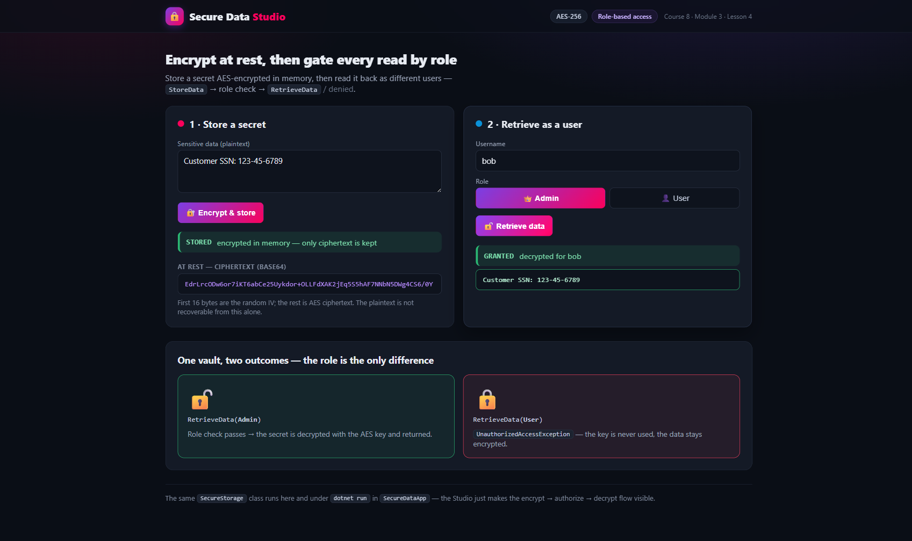

# Implementing Secure Data Storage

**Course 8 — Security and Authentication** · Module 3 · Lesson 4 · `You Try It!`

> Store sensitive data **encrypted at rest** with **AES**, then gate every read behind a
> **role check** so only an `Admin` can decrypt it. The crypto + authorization logic lives in
> one reusable `SecureStorage` class, exercised three ways: a console demo (the literal lab),
> an xUnit test suite, and an interactive Blazor **Studio**.

---

## 🎯 Objective

Implement secure data storage techniques: **encrypt** data before it sits in memory, **authorize**
retrieval by user role, and **test** that both hold. You will use the `System.Security.Cryptography`
**AES** primitives, model users with roles, and prove — with output, tests, and a live UI — that data
is unreadable at rest and that access is denied without the right role.

---

## 🗂️ What you'll build

A solution named **`SecureData`** with four projects that share one piece of logic:

| Project                 | Type          | Responsibility                                                        |
| ----------------------- | ------------- | -------------------------------------------------------------------- |
| `SecureDataCore`        | class library | `User` + `Roles` and `SecureStorage` (AES encrypt/decrypt + role gate) |
| `SecureDataApp`         | console       | The literal lab: two users, `StoreData`/`RetrieveData`, logged output |
| `SecureDataCore.Tests`  | xUnit         | Round-trip, "encrypted at rest", Admin-allowed, non-Admin-denied      |
| `SecureDataStudio`      | Blazor Server | Interactive demo: type data → see ciphertext → toggle role → granted/denied |

**Flow:** `StoreData(plaintext) → AES encrypt (random IV) → ciphertext in memory → RetrieveData(user) → role == Admin ? decrypt : UnauthorizedAccessException`

> **Why one `SecureStorage`, not a copy per app?** The task names `Models/User.cs` and
> `Models/DataStorage.cs`. Here those files live once in `SecureDataCore`, and the console, tests,
> and Studio all reference it — the same *separation of concerns* the encryption lesson teaches, with
> no duplicated cryptography.

---

## ✅ Prerequisites

- .NET SDK installed — check with `dotnet --version`
- Visual Studio Code with the C# Dev Kit
- A terminal open at the folder where you want the solution

---

## 🛠️ Steps

### Step 1 — Prepare the solution

Scaffold a solution with the four projects, wire the references, and confirm a green build.

```bash
dotnet new sln -n SecureData
dotnet new classlib -n SecureDataCore   -o SecureDataCore
dotnet new console  -n SecureDataApp    -o SecureDataApp
dotnet new xunit    -n SecureDataCore.Tests -o SecureDataCore.Tests
dotnet new blazor   -n SecureDataStudio -o SecureDataStudio --interactivity Server

dotnet sln SecureData.slnx add SecureDataCore SecureDataApp SecureDataCore.Tests SecureDataStudio
dotnet add SecureDataApp        reference SecureDataCore
dotnet add SecureDataStudio     reference SecureDataCore
dotnet add SecureDataCore.Tests reference SecureDataCore

dotnet build
```

> On .NET 9+ `dotnet new sln` creates the XML-based **`SecureData.slnx`**, so add projects to that file.

### Step 2 — Encrypt stored data

In `SecureDataCore`, create `Models/DataStorage.cs` with a `SecureStorage` class. It encrypts plaintext
with a symmetric **AES** key, keeps only the ciphertext in memory, and generates a fresh **IV** per
encryption (prepended to the ciphertext so decryption can read it back).

```csharp
using System.Security.Cryptography;
using System.Text;

namespace SecureDataCore.Models;

public sealed class SecureStorage
{
    private readonly byte[] _key;
    private byte[]? _encrypted;

    public SecureStorage(byte[] key)
    {
        ArgumentNullException.ThrowIfNull(key);
        if (key.Length is not (16 or 24 or 32))
            throw new ArgumentException("AES key must be 16, 24, or 32 bytes.", nameof(key));
        _key = key;
    }

    public bool HasData => _encrypted is not null;

    public void StoreData(string plaintext)
    {
        ArgumentNullException.ThrowIfNull(plaintext);
        _encrypted = Encrypt(Encoding.UTF8.GetBytes(plaintext));
    }

    // Raw bytes held at rest (IV + ciphertext) for proof/inspection; never decrypts.
    public byte[] GetEncryptedBytes()
        => _encrypted is null
            ? throw new InvalidOperationException("No data has been stored yet.")
            : (byte[])_encrypted.Clone();

    private byte[] Encrypt(byte[] plainData)
    {
        using var aes = Aes.Create();
        aes.Key = _key;
        aes.GenerateIV();

        using var encryptor = aes.CreateEncryptor();
        var cipher = encryptor.TransformFinalBlock(plainData, 0, plainData.Length);

        var result = new byte[aes.IV.Length + cipher.Length];
        Buffer.BlockCopy(aes.IV, 0, result, 0, aes.IV.Length);
        Buffer.BlockCopy(cipher, 0, result, aes.IV.Length, cipher.Length);
        return result;
    }

    private byte[] Decrypt(byte[] ivAndCipher)
    {
        using var aes = Aes.Create();
        aes.Key = _key;

        var iv = new byte[aes.BlockSize / 8];
        var cipher = new byte[ivAndCipher.Length - iv.Length];
        Buffer.BlockCopy(ivAndCipher, 0, iv, 0, iv.Length);
        Buffer.BlockCopy(ivAndCipher, iv.Length, cipher, 0, cipher.Length);
        aes.IV = iv;

        using var decryptor = aes.CreateDecryptor();
        return decryptor.TransformFinalBlock(cipher, 0, cipher.Length);
    }
}
```

### Step 3 — Configure access controls

In `Models/User.cs`, model who is asking and in what role, and add the role gate to `RetrieveData`.
Only an `Admin` may decrypt; anyone else gets an `UnauthorizedAccessException` and the data stays
encrypted.

```csharp
namespace SecureDataCore.Models;

public sealed class User(string username, string role)
{
    public string Username { get; } = username;
    public string Role { get; } = role;
}

// Named role constants keep authorization checks free of magic strings.
public static class Roles
{
    public const string Admin = "Admin";
    public const string User = "User";
}
```

Add the gated read to `SecureStorage` (it decrypts *only after* the role check passes):

```csharp
public string RetrieveData(User user)
{
    ArgumentNullException.ThrowIfNull(user);
    if (_encrypted is null)
        throw new InvalidOperationException("No data has been stored yet.");
    if (!string.Equals(user.Role, Roles.Admin, StringComparison.Ordinal))
        throw new UnauthorizedAccessException(
            $"Access denied for '{user.Username}' (role '{user.Role}'). Admin role required.");

    return Encoding.UTF8.GetString(Decrypt(_encrypted));
}
```

### Step 4 — Test secure storage

**Write the tests first (TDD).** In `SecureDataCore.Tests`, prove the four behaviours that matter:
the round trip, that bytes at rest are ciphertext, that an Admin is allowed, and that a non-Admin is
denied.

```csharp
using System.Security.Cryptography;
using System.Text;
using SecureDataCore.Models;

public class SecureStorageTests
{
    private static byte[] TestKey() => SHA256.HashData("unit-test-key"u8.ToArray());
    private static User Admin()   => new("root",  Roles.Admin);
    private static User Regular() => new("guest", Roles.User);

    [Fact]
    public void Admin_can_store_then_retrieve_the_original_plaintext()
    {
        var storage = new SecureStorage(TestKey());
        storage.StoreData("Top secret: launch codes 0000");
        Assert.Equal("Top secret: launch codes 0000", storage.RetrieveData(Admin()));
    }

    [Fact]
    public void Stored_bytes_are_ciphertext_not_the_plaintext()
    {
        var storage = new SecureStorage(TestKey());
        storage.StoreData("Sensitive PII: 123-45-6789");
        var atRest = Encoding.UTF8.GetString(storage.GetEncryptedBytes());
        Assert.DoesNotContain("Sensitive PII", atRest);
    }

    [Fact]
    public void Non_admin_retrieval_is_denied()
    {
        var storage = new SecureStorage(TestKey());
        storage.StoreData("Top secret");
        Assert.Throws<UnauthorizedAccessException>(() => storage.RetrieveData(Regular()));
    }

    [Fact]
    public void Same_plaintext_produces_different_ciphertext_due_to_random_iv()
    {
        var a = new SecureStorage(TestKey()); a.StoreData("same input");
        var b = new SecureStorage(TestKey()); b.StoreData("same input");
        Assert.NotEqual(a.GetEncryptedBytes(), b.GetEncryptedBytes());
    }
}
```

```bash
dotnet test
```

Then drive the same class from the console (`SecureDataApp/Program.cs`). The key comes from
`appsettings.json` (`Encryption:Key`, a base64 32-byte AES-256 key) — never hard-coded.

```csharp
using Microsoft.Extensions.Configuration;
using SecureDataCore.Models;

var config = new ConfigurationBuilder()
    .SetBasePath(AppContext.BaseDirectory)
    .AddJsonFile("appsettings.json", optional: false)
    .Build();

var storage = new SecureStorage(Convert.FromBase64String(config["Encryption:Key"]!));

var admin   = new User("alice", Roles.Admin);
var regular = new User("bob",   Roles.User);

storage.StoreData("Customer SSN: 123-45-6789");
Console.WriteLine($"At rest (base64) : {Convert.ToBase64String(storage.GetEncryptedBytes())}");

TryRetrieve(admin);
TryRetrieve(regular);

void TryRetrieve(User user)
{
    Console.Write($"{user.Username} (role '{user.Role}') -> ");
    try   { Console.WriteLine($"GRANTED: \"{storage.RetrieveData(user)}\""); }
    catch (UnauthorizedAccessException ex) { Console.WriteLine($"DENIED: {ex.Message}"); }
}
```

### Step 5 — Make it interactive (Studio)

Register `SecureStorage` for DI in `SecureDataStudio/Program.cs` (scoped = one vault per browser
circuit), seeding it with the configured key:

```csharp
builder.Services.AddScoped(sp =>
{
    var key = sp.GetRequiredService<IConfiguration>()["Encryption:Key"]
        ?? throw new InvalidOperationException("Encryption:Key is not configured.");
    return new SecureStorage(Convert.FromBase64String(key));
});
```

In `Components/Pages/Home.razor`, mark the page `@rendermode InteractiveServer`, `@inject SecureStorage`,
and wire two buttons: **Encrypt & store** (shows the ciphertext) and **Retrieve data** (decrypts for an
Admin, shows `DENIED` for a User). Run it:

```bash
# Blazor dev run: Development environment + http profile
ASPNETCORE_ENVIRONMENT=Development dotnet run --project SecureDataStudio --urls http://localhost:5247
```



---

## ▶️ Expected result

Running the console prints unreadable ciphertext for the stored secret, then **grants** the Admin and
**denies** the regular user:

```text
=== Secure Data Storage demo ===

Stored plaintext : Customer SSN: 123-45-6789
At rest (base64) : m6LXytPGZuqxuODLLlSHvhTGOc2EEyqJlOSYf/jKVc1rQXEn9Cf8zVFaBpu1hmCS
  -> the bytes above are ciphertext (IV + AES); plaintext is not recoverable from them alone.

alice (role 'Admin') requests the data -> GRANTED: "Customer SSN: 123-45-6789"
bob (role 'User') requests the data -> DENIED: Access denied for 'bob' (role 'User'). Admin role required.
```

`dotnet test` reports all green, and the Studio shows the same two outcomes live — same `SecureStorage`,
just made visible.

---

## ☑️ Definition of done

- [ ] `SecureData` solution with four projects builds clean (`dotnet build`)
- [ ] `SecureStorage` encrypts data with a symmetric **AES** key and a fresh **IV** per call
- [ ] Data held in memory is ciphertext — the plaintext is not present in the raw bytes
- [ ] `RetrieveData` returns the original only for an `Admin`; others get `UnauthorizedAccessException`
- [ ] xUnit tests cover round-trip, "encrypted at rest", Admin-allowed, and non-Admin-denied — all green
- [ ] The console logs ciphertext at rest, a granted Admin read, and a denied User read
- [ ] The AES key is loaded from configuration, never hard-coded in source

---

## 🔑 Key concepts

- **Symmetric encryption (AES)** — the *same* key encrypts and decrypts. `Aes.Create()` gives a vetted,
  hardware-accelerated implementation; never roll your own cipher.
- **The IV is not secret, but must be unique** — a fresh initialization vector per encryption (stored at
  the front of the ciphertext) means the *same* plaintext encrypts to *different* bytes each time. That
  is why `Same_plaintext_produces_different_ciphertext` passes — and why reusing an IV leaks information.
- **Access control sits on top of crypto** — `RetrieveData` checks the role *before* it ever touches the
  key. A denied caller never triggers a decryption, so the secret stays encrypted.
- **Separation of concerns** — cryptography and authorization live in `SecureStorage`; the console,
  tests, and Studio only orchestrate it. One place to audit, one place to fix.
- **Honest caveat — role strings vs. real authorization.** Comparing `Role == "Admin"` is fine for a
  teaching demo, but production ASP.NET Core uses **claims/policy-based authorization**
  (`[Authorize(Roles = "Admin")]`, policies, requirements) — see Module 1 (Roles and Claims) and
  Module 2. `Roles` constants here at least keep the magic string in one place.
- **Honest caveat — "at rest" in one process.** Encrypting an in-memory value inside a single console
  app does not truly protect it: the key lives in the same process. Real *data at rest* means encrypting
  the disk/database and holding the key in a **key vault** with rotation. The value of this lab is the
  *technique* — AES usage, IV handling, and layering access control over encryption.
